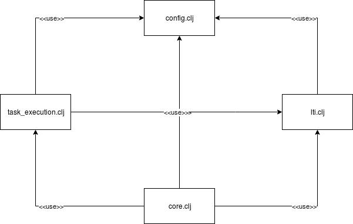

# Dokumentation für EFP-SyntaxChecker

**EFP SoSe 2017**

Philipp Minges 1426312
Maximilian Blatt 1423983

## Projektstruktur

Das Projekt ist aufgeteilt in einen Webservice (Clojure) und einen Webclient (JavaScript) aufgeteilt. Es ist eine integration in Moodle möglich, beide können jedoch auch unabhängig davon betrieben werden.

Der Client hört auf Port 8079 (Https), während der Webservice auf den Ports 8080 (Http) und 8081 (Https) lauscht.

### Client (Javascript Webclient)

Der Client wird über einen NodeJs Webserver ausgeliefert. Der Client dient der Darstellung der Aufgaben und deren Fehlerklassen, der Eingabe der zu überprüfenden Daten, deren Konvertierung in ein JSON Dateiformat und der Auslieferung der Ergebnisse.

#### Start

Um den Client vorzubereiten benötigt man ein installiertes NodeJs und Bower mit denen die einzelnen Packages installiert werden. Der Server wird gestartet mit

```
npm start
```

#### Funktionalität

Beim Aufruf Clients, führt dieser die Funktion ```readTasks()``` aus. Dabei wird ein GET Request auf die Webservice URL ```/api/tasks``` ausgefürt. Anschließend erhält der Client ein JSON Objekt aller Aufgaben (Tasks) und deren Fehlerklassen (Trigger). 

Nach der Auswahl einer Aufgabe wird mit Hilfe der Funktion ```createTriggerTable(triggerName)``` aus dem JSON Objekt des Tasks eine HTML Tabelle erstellt, welche die Fehlerklassen repräsentiert.

Vor dem Upload der Daten werden diese zuerst in ein JSON Format gebracht. Der Webclient erhält die Daten vom Browser via HTML multipart/form-data. Anschließend wird die Funktion ```uploadJSON()``` genutzt um zuerst aus dem Namen und dem Inhalt des Objekts die folgende Objektstruktur zur weiterverarbeitung zu erzeugen

```
{
    taskName: <taskName>,
    files: [
        <filename>: <content>,
        <content> : <filecontent>
        ...
    ]
}
```

und anschließend das Objekt mit einem POST an die Webservice URL ```/api/execute``` zu senden. 

Hierbei werden optional die Moodle Parameter in der URL zum Webservice übermittelt. Siehe [Webservice API](#moodle-params).

Die Visualisierung der Antwort des Webservice findet in der Funktion ```displayValidationResponse(data)``` statt.

### Server (Clojure Webservice)

Der in Clojure progammierte Webservice ist die zentrale Komponente des Projekts. Hier folgt eine genauere Erläuterung seiner Funktionen.

#### Start

Der Start des Webservice erfolgt über die Kommandozeile mit 

```
lein run
```

#### Architektur

Der Webservice ist wie folgt aufgebaut:



#### Webservice API

Dieser Abschnitt enthält die Dokumentation der REST-Schnittstelle des Webservice.

##### GET ```/api/tasks```

Liefert eine Liste aller Aufgaben und ihrer Fehlerklassen, die vom Webservice angeboten werden.

Response Format:
```
[
    {
        "name": <taskname>,
        "triggers": [
            {
                "name": <triggername>
            },
            ...
        ]
    },
    ...
]
```
##### <a name="moodle-params"></a>POST ```/api/execute?lis_outcome_service_url=<value>&lis_result_sourcedid=<value>```

Die URL-Parameter sind optional. Bei ihrem Vorhandensein wird die Bewertung (Prozent der abgeschlossenen Aufgaben) zusätzlich an Moodle übermittelt.

Request Format:
```
{
    taskName: <taskName>,
    files: [
        <filename>: <content>,
        <content> : <filecontent>
        ...
    ]
}
```

Response Body format:
```
[
    {
        "name": <triggername>,
        "success": <true|false>,
        "message": <string>
    },
    ...
]
```

##### POST ```/lti/launch```

Ziel URL für den Launch Request von Moodle.

Die Antwort enthält lediglich eine Weiterleitung an den Client.

#### Fehlerklassen

Dieser Abschnitt definiert die einzelnen Tasks und die Fehlerklassen, die vom Webservice angeboten und in der Datei ```config.clj``` definiert werden. Alle Fehlerklassen werden mit Hilfe von Regex überprüft.

##### Aufgabe 1

* exercise1.trigger.className: \
    Der Klassenname muss ```FileServer``` heißen.\
    Regex: ```#"class\s+FileServer"```

* exercise1.trigger.packageName \
    Die Klasse muss im Paket ```var``` oder einem Unterpaket liegen. \
    Regex: ```#"package\s+var"```

* exercise1.trigger.properties \
    Die Datei ```jndi.properties``` mit dem Eintrag ```queue.files``` muss existieren. \
    Regex: ```#"queue.files[ \t]+=[ \t]+\w+"```

* exercise1.trigger.textMessage \
    In der Klasse ```FileServer``` muss die Klasse ```TextMessage``` verwendet werden. \
    Regex: ```#"TextMessage"```

##### Aufgabe 2

* exercise2.trigger.chatclient \
    Die Klasse ```ChatClient``` muss im Paket ```var.rmi.chat``` liegen. \
    Regex: ```#"package\s+var\.rmi\.chat[\s\S]+class\s+ChatClient"```

* exercise2.trigger.chatserver \
    Die Klasse ```ChatServer``` muss im Paket ```var.rmi.chat``` liegen. \
    Regex: ```#"package\s+var\.rmi\.chat[\s\S]+class\s+ChatServer"```

* exercise2.trigger.conf \
    Die Klasse/Interface  ```Conf``` muss das Feld  ```static final CHATSERVICE``` besitzen. \
    Regex: ```#"public\s+static\s+final\s+String\s+CHATSERVICE"```

* exercise2.trigger.useconf \
    ```Conf.CHATSERVICE``` muss in der Klasse  ```ChatClient``` verwendet werden. \
    Regex: ```#"Conf\.CHATSERVICE"```

#### Design Patterns

Dieser Abschnitt enthält eine Auswahl der verwendeten funktiononalen Design-Patterns die in diesem Projekt verwendet werden.

* Filter-Map-Reduce (```lti.clj:13```)
* Decorator Pattern (```core.clj:32```)
* Chain of Operations (```lti.clj:18```)

#### Verwendete Bibliotheken

Zur Anbindung an LTI wird eine spezielle Bibliothek von IMS Global verwendet:

<https://github.com/IMSGlobal/basiclti-util-java>

### Ablauf der Benutzung

Die Anwendung kann entweder direkt über die Webaddresse (Guest mode) oder über Moodle in einem Basic LTI Launch aufgerufen werden.

Bei letztem wird der Launch Request an den Webservice (Port 8081) and die URL ```lti/launch``` gesendet. Dieser gibt eine Weiterleitung auf den Client mit den Launch Parameter als Query String zurück.

Auf dem Client werden nun die in ```config.clj``` definierten Task vom Webservice über ```api/tasks``` geladen und dem Nutzer angezeigt.

Dieser kann nun einen auswählen und zusammen mit einer beliebigen Anzahl an Dateien über ```api/execute``` zurücksenden. Dabei werden die LTI Parameter, falls vorhanden, als Query String mitgesendet.

Der Server führt nun den spezifizierten Task aus und sendet das Ergebnis zurück. Sollte die LTI Parameter mitgeschickt werden, wird für der Antwort ein Outcome Request an Moodle geschickt, welcher die erreichte Note enthält.

Die Note ist eine Zahl zwischen 0.0 und 1.0, welche den Anteil der bestanden Fehlerklassen an der gesamten Zahl der Fehlerklassen enthält.

### Kompatibilität

Das Projekt wurde auf einem Ubuntu Linux 17.04 System getestet. 

Es kann jedoch nach der Installation von NodeJS und Leiningen auch auf den Betriebssystemen Windows und MacOS ausgeführt werden.
